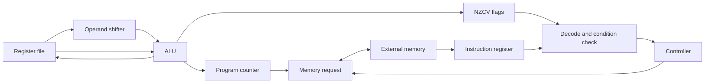

# Architecture

`tiny_arm` is a non-pipelined, multi-cycle core. All registers update on the rising clock edge. Reset is synchronous and active high. The default reset vector is zero; `RESET_VECTOR` can change it to another word-aligned address.

## State machine

1. **FETCH** holds an instruction read request until `mem_ready`. It captures the returned word, or stops on a bus error.
2. **EXECUTE** checks the condition, decodes the instruction, and computes the result. Register-only instructions finish here. A load/store instead records a pending memory operation.
3. **MEMORY** holds the data request until `mem_ready`. Loads and base writeback commit only after a successful response.
4. **STOP** issues no requests and changes no architectural state. Reset restarts execution.

With zero wait states, a register operation or branch takes two cycles, and a load/store takes three. Each stalled fetch or data transfer adds its wait cycles. There is no overlap between instructions.

## Programmer-visible state

- Fifteen 32-bit registers: `r0`–`r12`, `r13`/`sp`, `r14`/`lr`.
- A separate 32-bit instruction address. Reading `r15` in supported operands returns that address plus eight. `debug_pc` exposes the instruction address itself.
- Four flags, packed `{N,Z,C,V}`. Reset clears the flags and all general registers, including `sp`.
- Little-endian byte lanes. Word memory accesses and executable branch targets must be aligned to four bytes.

There is no CPSR beyond these flags, SPSR, processor mode, interrupt state, or Thumb state. Reset does not clear external RAM; the testbench initializes RAM separately.

## Instruction boundary

All supported instructions use A32's 32-bit encoding. The implementation targets the following older ARM instruction forms, rather than claiming conformance to a complete architecture version.

| Family | Accepted forms | Restrictions |
| --- | --- | --- |
| Data processing | AND/EOR/SUB/RSB/ADD/ADC/SBC/RSC/TST/TEQ/CMP/CMN/ORR/MOV/BIC/MVN | Rotated 8-bit immediate, or register with an immediate shift only |
| Flags | Optional S on result-writing instructions; required on tests/comparisons | Logical operations preserve V; arithmetic computes C and V |
| Branch | B and BL with signed immediate displacement | BL writes the next instruction address to `lr` |
| Register branch | BX Rm | Only aligned A32 targets; a Thumb request faults |
| Memory | LDR/STR/LDRB/STRB with signed 12-bit immediate offsets | Pre-indexed with optional writeback, or post-indexed |
| PC destinations | Non-S data processing or word LDR to `r15` | Target must be word-aligned |
| Monitor | SVC/SWI immediate zero | Project-specific halt, with no architectural exception entry |

For data processing, test/comparison encodings require `Rd=0`; MOV/MVN require `Rn=0`. `S=1` with a result destination of PC is rejected because it requires status restoration that this core does not implement. Register-specified shifts, multiply encodings, and the miscellaneous instruction extension spaces are rejected.

Memory restrictions are explicit: register offsets, translated transfers (`P=0,W=1`), writeback to PC, writeback with base equal to destination/source, byte transfers to/from PC, and storing PC are rejected. PC-relative literal word loads work. Post-indexing always updates the base. Offset arithmetic wraps at 32 bits.

Normal conditions `0000`–`1110` are evaluated before decoding. A failed condition advances PC without executing, changing flags, or issuing a data request—even if that instruction form would otherwise be unsupported. Condition `1111` always faults, since its extension space is unsupported.

Some full ARM implementations allow or define behaviors that this project deliberately rejects, including certain unaligned PC writes and unaligned loads. Use the stricter contract above when writing programs.

## Memory port

| Signal | Direction | Meaning |
| --- | --- | --- |
| `mem_valid` | Out | A request is present |
| `mem_ready` | In | The request completes on this rising edge |
| `mem_instr` | Out | Instruction fetch versus data access |
| `mem_write` | Out | Write versus read |
| `mem_addr[31:0]` | Out | Word-aligned byte address |
| `mem_wdata[31:0]` | Out | Write data placed in the addressed byte lanes |
| `mem_wstrb[3:0]` | Out | Write enables for bytes 0–3; zero for reads |
| `mem_rdata[31:0]` | In | Full addressed word, including for byte reads |
| `mem_error` | In | Fault on a completing request |

A transfer occurs only when `mem_valid && mem_ready` at a rising edge. A memory controller must hold off writes until this handshake and must suppress a write when reporting `mem_error`. An error without `mem_ready` is ignored. All request signals remain stable while waiting; there is only one outstanding transfer. After acceptance, this core deasserts `mem_valid` before issuing its next request.

Byte accesses align the bus address down and select a lane internally. For example, storing `0xAA` at byte address `0x103` produces bus address `0x100`, data `0xAA000000`, and strobes `1000`. Byte loads zero-extend the selected byte. Word accesses with either low address bit set fault before a data request is issued.

Synchronous RAM can latch a request, perform its read, then assert `mem_ready` while presenting the result. It need not respond in the same cycle. Gate every external write with `mem_valid && mem_ready && mem_write && !mem_error`.

Reset immediately suppresses `mem_valid` and clears CPU state on the next rising edge. A memory wrapper must cancel any still-pending response on reset. Reset cannot undo a transfer already accepted before it was asserted.

## Halt, faults, and tracing

| `fault` | Meaning |
| --- | --- |
| 0 | No fault; `halted=1` indicates the `svc #0` monitor stop |
| 1 | Unsupported or disallowed instruction encoding |
| 2 | Misaligned word access, PC target, or reset vector |
| 3 | Memory bus error |
| 4 | BX requested Thumb execution |

`halted` remains asserted until reset. PC remains at the stopping instruction, or at the attempted fetch address for a fetch error. A faulting instruction does not retire, update flags, update its destination register, or write back its base register. The external memory wrapper is responsible for rejecting faulting writes without side effects.

`trace_valid` pulses once per completed instruction, including a failed condition and the monitor stop. `trace_pc` and `trace_instr` identify that instruction. Registers and flags then contain its committed results. Debug register reads use the same PC-plus-eight convention as instruction operands.

The testbench has 64 KiB of shared instruction/data RAM and faults on addresses outside that range. The core itself has a full 32-bit address port and no built-in RAM or I/O devices.

## References

Encoding and instruction semantics were checked against Arm's [Architecture Reference Manual, DDI 0100I](https://documentation-service.arm.com/static/5f8dacc8f86e16515cdb865a), especially chapters A3–A5. Arm's [condition-code explanation](https://developer.arm.com/community/arm-community-blogs/b/architectures-and-processors-blog/posts/condition-codes-2-conditional-execution) provides additional background. These references describe broader architectures; this project's accepted subset and monitor behavior are defined above.
